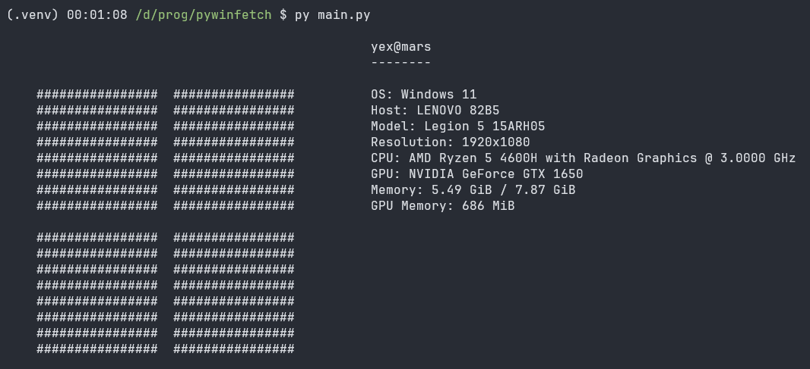

# winfetch.py

`winfetch.py` is a Python utility that provides system information and an ASCII art Windows logo similar to Neofetch for Windows operating systems.

## Features

- Display system information, including OS version, hostname, CPU, GPU, RAM, and more.
- Show a customizable ASCII art Windows logo.
- Easily integrate into your command-line interface (CLI) applications.

## Installation

You can run `pywinfetch` directly from the source code and install the dependencies manually.
